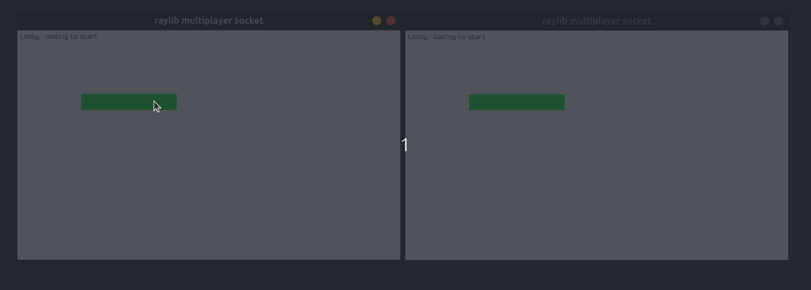
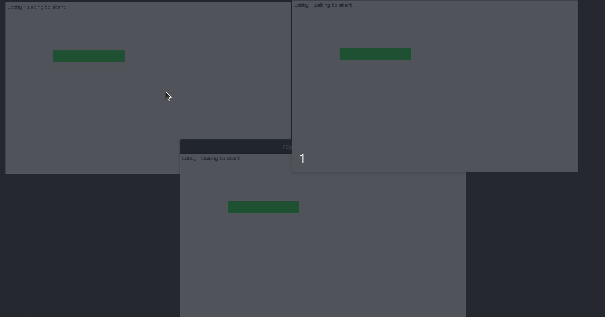

# 🎮 Mini Multiplayer Server - C / Raylib

Ce projet est un petit prototype de **serveur multijoueur** codé en **C** avec des clients graphiques utilisant **Raylib**. Il a été développé en **2 jours** dans le but d’expérimenter les sockets, la synchronisation réseau et un protocole custom simple en TCP/IP classic.

J'ai utilisé [raylib-quickstart](https://github.com/raylib-extras/raylib-quickstart) ainsi que l'exemple [example - input keys](https://github.com/raysan5/raylib/blob/master/examples/core/core_input_keys.c) (demo de l'exemple [dispo ici](https://www.raylib.com/examples.html) ) comme base.


---

## 🐧 Plateforme

* ✅ Linux (testé sur Ubuntu 24.04)
* ❌ Pas compatible Windows (utilisation de unistd.h, select(), etc.)

## 🧠 Concept

- Le serveur central gère les connexions et la communication entre joueurs.
- Chaque client représente un joueur contrôlant un **cercle** à l’écran.
- Lorsque deux joueurs ou plus sont prêts, la "partie" commence.
- Les positions sont synchronisées en temps réel entre les clients.

---

## 🔌 Protocole Réseau

Le protocole utilise un format compact :

```
[type: 1 octet][size: 2 octets][data: size octets]
```

### Types de messages (`type`)

| Code | Signification            | Sens                       | data                       |
| ---- | ------------------------ | -------------------------- | -------------------------- |
| `H`  | HELLO                    | client ➡️ serveur           | 0                          |
| `W`  | WELCOME                  | client ⬅️ serveur           | id                         |
| `R`  | READY                    | client ➡️ serveur           | 0                          |
| `G`  | GO - lancer le jeu       | Tout les clients ⬅️ serveur | 0                          |
| `M`  | PLAYER_MOVE              | client ➡️ serveur           | position X et Y            |
| `U`  | UPDATE_ALL_PLAYERS       | client ⬅️ serveur           | tableau de position X et Y |
| `B`  | BYE                      | client ➡️ serveur           | 0                          |
| `E`  | ERROR (serveur → client) | client ⬅️ serveur           | ?                          |

---

## 📁 Structure du projet

```bash
.
├── move_player/
│   ├── bin/
│   ├── build/
│   ├── include/
│   ├── Makefile
│   ├── README.md
│   ├── resources/
│   └── src
│       ├── application.rc
│       ├── icon.ico
│       └── main.c
├── README.md
└── server/
    ├── main.c
    ├── net_protocol.h
    └── server

```

## ⚙️ Compilation

### Serveur
```bash
gcc -o server server.c
./server
```
### Client (nécessite Raylib)

- #### VSCode Users (all platforms)
*Note* You must have a compiler toolchain installed in addition to vscode.

* Download the quickstart
* Rename the folder to your game name
* Open the folder in VSCode
* Run the build task ( `CTRL+SHIFT+B` or `F5` )
* You are good to go

- #### Linux Users
* CD into the build folder
* run `./premake5 gmake`
* CD back to the root
* run `make`
* you are good to go


## 🎯 Fonctionnalités

* Serveur TCP mono-threadé, gestion simple des sockets.
* Protocole structuré avec en-tête [type][size][data].
* Broadcast des positions à tous les joueurs actifs.
* Détection des joueurs prêts avant de démarrer.
* Gestion basique des déconnexions.

## 📌 Notes techniques

* Le serveur ne plante plus si un client se déconnecte brutalement.
* Utilisation de select() pour surveiller plusieurs sockets sans threads.

## 📷 Aperçu

2 clients :



3clients :


